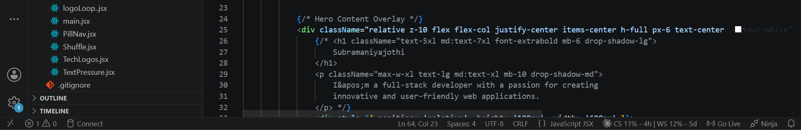
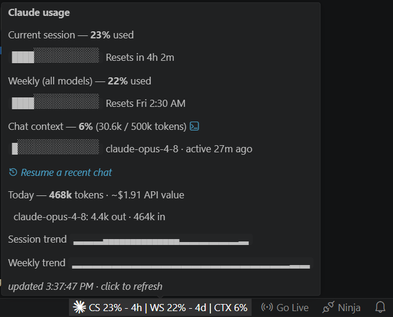
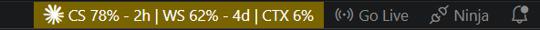
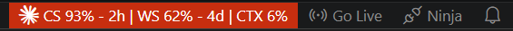

# ClaudeGauge

Your Claude Code quota **and live context window** at a glance. A tiny
**status bar** readout — current **5-hour session**, **weekly** quota, and how
full the active chat's **context window** is — always visible at the bottom of
VS Code. Mirrors Claude Code's `/usage` and `/context` views, plus multi-chat
tracking, one-click resume of closed chats, and daily token stats.

```
✳ CS 17% - 3h | WS 7% - 3d | CTX 42%
```

`CS` = current session, `WS` = weekly, `CTX` = how full the active chat's
**context window** is. The `- 3h` / `- 3d` is the time until each limit resets.
Hover the item for full bars, exact reset times, and token counts; click it to
refresh now.

> **Not affiliated with Anthropic.** This is an unofficial community tool. It
> reads your existing Claude Code login and Anthropic's own usage API — nothing
> more.

## Screenshots

| Status bar | Hover tooltip |
| --- | --- |
|  |  |

Color-coded as limits approach — orange from 75%, red from 90%:

| Warning (≥ 75%) | Critical (≥ 90%) |
| --- | --- |
|  |  |

The detailed split-terminal view:


## Features

- **Always-visible** session + weekly usage in the status bar, with time until
  each resets.
- **Hover tooltip** with progress bars, exact reset times, per-model (Opus /
  Sonnet) weekly usage, pay-as-you-go credits, and **trend sparklines**.
- **Live context window** of the active Claude Code chat (`CTX 42%`), read
  locally from the session transcript — token count, model, and a warning
  before auto-compact kicks in. Hidden automatically when the chat has been
  idle for 30 minutes.
- **Multiple chats?** The status bar shows `CTX 42% +1` when other chats are
  active; the tooltip lists every chat (named by its first message) with its
  own bar. Chats started in subfolders of the workspace are included too. By
  default the newest chat is tracked — pin a specific one with
  **"Claude Usage: Pick Chat to Track"** or the link in the tooltip.
- **Closed a chat by mistake?** Click the ↻ icon next to any chat in the
  tooltip, or run **"Claude Usage: Resume Recent Chat"** to pick from the last
  24 hours — it reopens the chat in a new terminal via `claude --resume`.
- **Daily stats** — today's total tokens and an estimated API-price value
  (what the day's usage would have cost at list prices), computed locally
  from your transcripts with a per-model breakdown in the tooltip.
- **Notifications** when you cross 80% / 90% (configurable).
- **Detailed terminal view** you can split beside the Claude terminal.
- Color-coded: blue → yellow at 75% → red at 90%.

## How it works

- Reads your OAuth access token from `~/.claude/.credentials.json` (the file
  Claude Code already manages — there's no separate login).
- Polls `https://api.anthropic.com/api/oauth/usage` (the same endpoint `/usage`
  uses) every 10 minutes and shows `five_hour` and `seven_day` utilization.
- The token is re-read from disk on each poll, so it stays valid as long as
  Claude Code keeps refreshing it.
- Results are cached to a temp file so reloads don't trigger extra requests,
  and a 429 (rate limit) backs off automatically up to 30 minutes.
- The context window readout never touches the network: Claude Code writes each
  chat to `~/.claude/projects/<project>/<session>.jsonl`, and the extension
  reads the last assistant message's `usage` block (input + cache tokens) every
  15 seconds to compute the fill percentage.

**Privacy:** nothing is sent anywhere except the usage request to Anthropic's
own API. The token is read from disk and used only for that request; it is
never stored or transmitted elsewhere. The temp cache stores only the
percentage/reset numbers, not your token.

> This relies on an **undocumented** endpoint, so it could change or break
> without notice.

## Extra: detailed view

There's also a detailed, `htop`-style bars view you can split beside your Claude
terminal — run **"Claude Usage: Open Detailed View Beside Terminal"** from the
Command Palette, or pick **Claude Usage** from the terminal split dropdown.

## Develop

1. Open this folder in VS Code, press **F5** (or run
   `code --extensionDevelopmentPath="<this folder>"`).
2. The usage appears in the bottom-right status bar.

## Test

```sh
npm install
npm test               # unit + mocked-network tests (fast, no VS Code)
npm run test:integration   # launches VS Code, checks activation/commands
npm run lint
```

## Package / install

```sh
npm i -g @vscode/vsce
vsce package                       # builds claude-usage-<version>.vsix
code --install-extension claude-usage-*.vsix
```

## Settings

| Setting | Default | Description |
| --- | --- | --- |
| `claudeUsage.refreshIntervalSeconds` | `600` | Poll interval (min 60s; endpoint is rate-limited). |
| `claudeUsage.credentialsPath` | `""` | Override path to `.credentials.json`. |
| `claudeUsage.notifyAt` | `[80, 90]` | Warn when session/weekly usage crosses these %. `[]` to disable. |
| `claudeUsage.showContextWindow` | `true` | Show the active chat's context-window fill (`CTX x%`). |
| `claudeUsage.showDailyStats` | `true` | Show today's tokens + estimated API value in the tooltip. |
| `claudeUsage.contextWindowTokens` | `0` | Window size for the % math. `0` = auto by model family (200k / 500k / 1M for `[1m]` models). The real window varies by plan — verify with `/context` and set explicitly if needed. |
| `claudeUsage.contextNotifyAt` | `[80]` | Warn when the chat context crosses these %, so you can `/compact` in time. `[]` to disable. |
| `claudeUsage.autoRefreshToken` | `false` | Renew an expired token and write it back to `.credentials.json`. Off by default so the extension never modifies your login file. |
